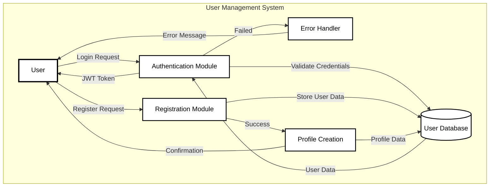
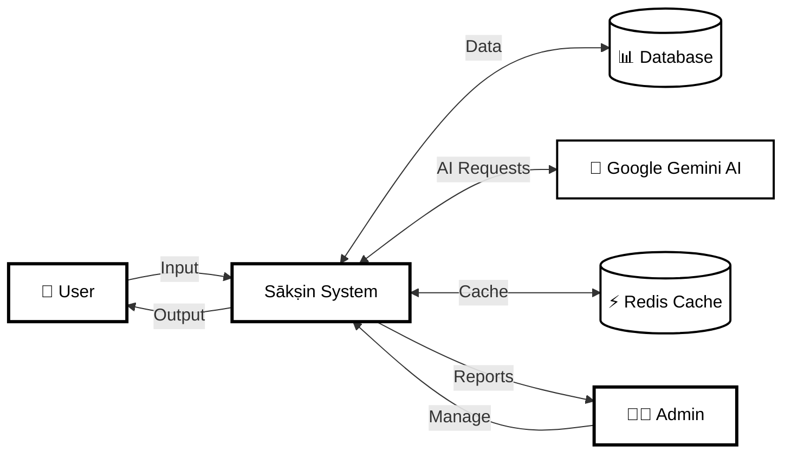
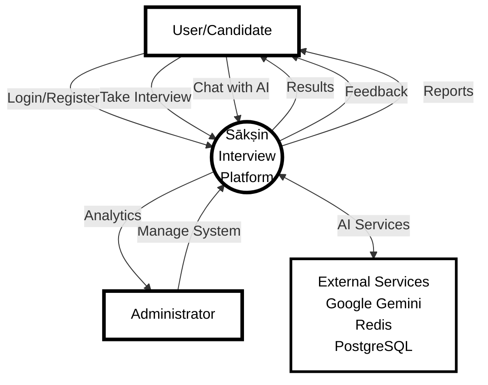
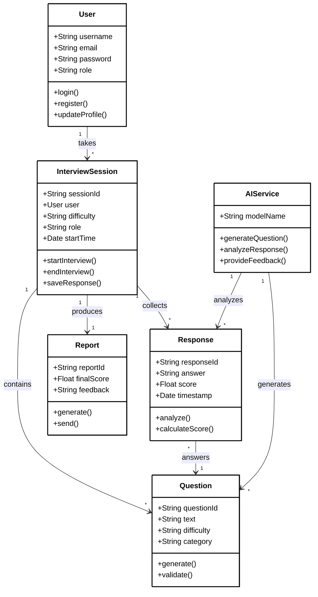
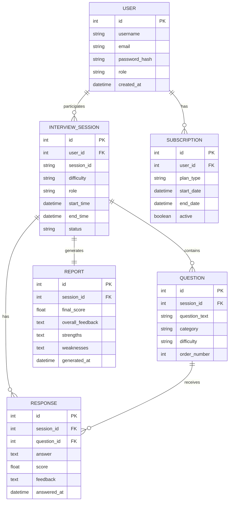
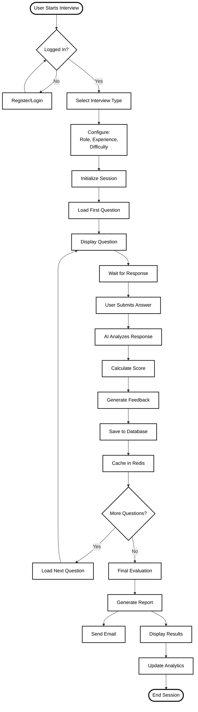
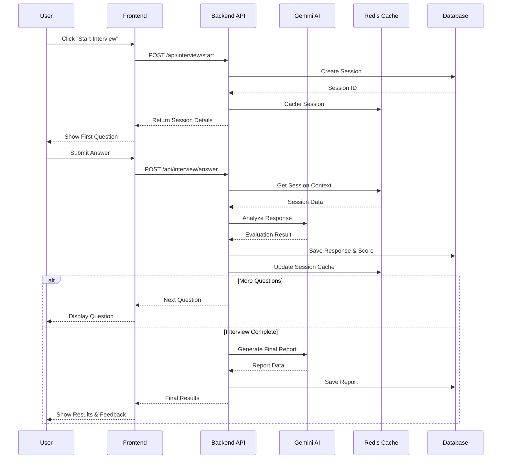
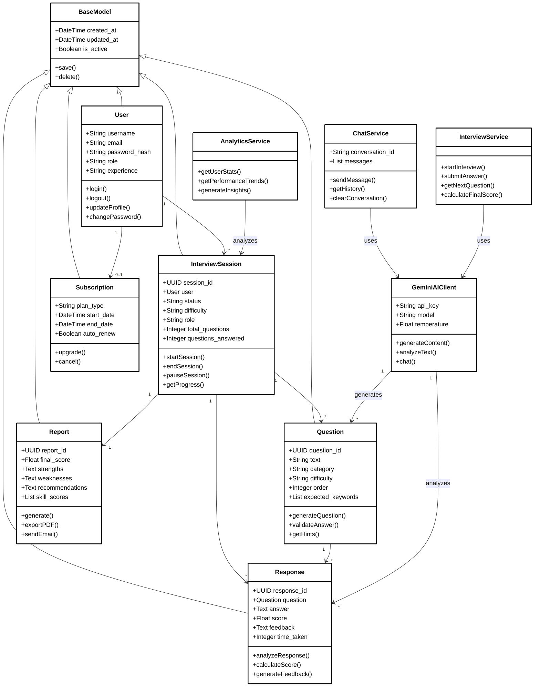

# 🏗️ Sākṣin Architecture Diagrams

## 1️⃣ DFD Level 2 - User Management (Authentication Process)

---

## 2️⃣ DFD Level 1 - System Overview

---

## 3️⃣ DFD Level 4 - Detailed Process Flow

```mermaid
flowchart TB
    subgraph "Detailed Interview Process"
        START[Start Interview] --> CONFIG[Configure Settings]
        CONFIG -->|Role, Experience| SETUP[Setup Session]
        
        SETUP --> GEN_Q[Generate Question]
        GEN_Q -->|AI Processing| GEMINI[Google Gemini]
        GEMINI -->|Question| DISPLAY[Display Question]
        
        DISPLAY -->|User Answers| CAPTURE[Capture Response]
        CAPTURE -->|Text| ANALYZE[Analyze Response]
        ANALYZE -->|AI Evaluation| GEMINI
        
        GEMINI -->|Feedback| STORE[Store Results]
        STORE --> CACHE[(Redis Cache)]
        STORE --> DB[(PostgreSQL)]
        
        ANALYZE --> DECISION{More Questions?}
        DECISION -->|Yes| GEN_Q
        DECISION -->|No| FINAL[Final Evaluation]
        
        FINAL --> REPORT[Generate Report]
        REPORT --> EMAIL[Send Email]
        REPORT --> DISPLAY_RESULT[Display Results]
        
        DISPLAY_RESULT --> END[End Session]
    end
    
    style START fill:#fff,stroke:#000,stroke-width:3px,color:#000
    style CONFIG fill:#fff,stroke:#000,stroke-width:2px,color:#000
    style SETUP fill:#fff,stroke:#000,stroke-width:2px,color:#000
    style GEN_Q fill:#fff,stroke:#000,stroke-width:2px,color:#000
    style GEMINI fill:#fff,stroke:#000,stroke-width:2px,color:#000
    style DISPLAY fill:#fff,stroke:#000,stroke-width:2px,color:#000
    style CAPTURE fill:#fff,stroke:#000,stroke-width:2px,color:#000
    style ANALYZE fill:#fff,stroke:#000,stroke-width:2px,color:#000
    style STORE fill:#fff,stroke:#000,stroke-width:2px,color:#000
    style CACHE fill:#fff,stroke:#000,stroke-width:2px,color:#000
    style DB fill:#fff,stroke:#000,stroke-width:2px,color:#000
    style DECISION fill:#fff,stroke:#000,stroke-width:2px,color:#000
    style FINAL fill:#fff,stroke:#000,stroke-width:2px,color:#000
    style REPORT fill:#fff,stroke:#000,stroke-width:2px,color:#000
    style EMAIL fill:#fff,stroke:#000,stroke-width:2px,color:#000
    style DISPLAY_RESULT fill:#fff,stroke:#000,stroke-width:2px,color:#000
    style END fill:#fff,stroke:#000,stroke-width:3px,color:#000
```

---

## 4️⃣ DFD Level 0 - Context Diagram

---

## 5️⃣ UML Diagram - System Classes

---

## 6️⃣ ER Diagram - Database Schema

---

## 7️⃣ Activity Diagram - Interview Flow

---

## 8️⃣ Sequence Diagram - Interview Process

---

## 9️⃣ Class Diagram - Detailed System Architecture

---

## 🖨️ Printing Instructions

### For A4 Paper Printing:

1. **Using Mermaid Live Editor:**
   - Go to https://mermaid.live/
   - Copy each diagram code
   - Click "Export" → "PNG" or "SVG"
   - Print with these settings:
     - Paper: A4
     - Orientation: Landscape (recommended)
     - Margins: Normal
     - Scale: Fit to page

2. **Using Markdown Preview:**
   - Open this file in VS Code
   - Use Markdown Preview Enhanced extension
   - Right-click → "Chrome (Puppeteer)" → "Export to PDF"
   - Print the PDF

3. **Using GitHub/GitLab:**
   - Push this file to your repository
   - View on GitHub/GitLab (they render Mermaid automatically)
   - Use browser's print function with:
     - Background graphics: ON
     - Scale: 90-100%

4. **Direct Browser Print:**
   - Open in browser with Mermaid support
   - Ctrl+P (Windows) / Cmd+P (Mac)
   - Enable "Background graphics"
   - Select A4 paper size

### Recommended Print Settings:
- **Paper Size:** A4 (210mm × 297mm)
- **Orientation:** Landscape for complex diagrams, Portrait for simple ones
- **Quality:** High/Best
- **Color:** Black & White (to save ink)
- **Margins:** 10mm all sides
- **Scale:** 90-95% (to avoid cutting edges)

---

**Created for:** Sākṣin AI-Powered Interview Platform  
**Date:** October 28, 2025  
**Version:** 1.0
